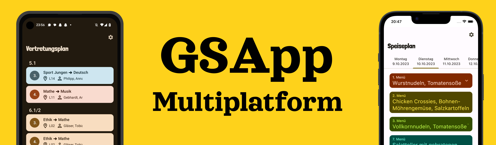

# GSApp3 Multiplatform

This is the semi-official app of Hermann Pistor Gymnasium Sonneberg. It displays substitution and
food plans in a mobile-friendly list and notifies on changes.

This is the rewrite, which utilizes Compose Multiplatform and (hopefully) a better architecture.
It's based on the [Compose Multiplatform Template](https://github.com/JetBrains/compose-multiplatform-template).

> **Note**
> At time of writing this, the iOS part of Compose Multiplatform is in Alpha. It may change 
> incompatibly and require manual migration in the future.

## Development
### Set up the environment

> **Warning**
> You need a Mac with macOS to write and run iOS-specific code on simulated or real devices.
> This is an Apple requirement.

To work across all platforms, you'll need:

* A machine running a recent version of macOS
* [Xcode](https://apps.apple.com/us/app/xcode/id497799835)
* [Android Studio](https://developer.android.com/studio)
* The [Kotlin Multiplatform Mobile plugin](https://plugins.jetbrains.com/plugin/14936-kotlin-multiplatform-mobile)
* The [CocoaPods dependency manager](https://kotlinlang.org/docs/native-cocoapods.html)

#### Check your environment

Before you start, use the [KDoctor](https://github.com/Kotlin/kdoctor) tool to ensure that your development environment
is configured correctly:

1. Install KDoctor with [Homebrew](https://brew.sh/):

    ```text
    brew install kdoctor
    ```

2. Run KDoctor in your terminal:

    ```text
    kdoctor
    ```

   If everything is set up correctly, you'll see valid output:

   ```text
   Environment diagnose (to see all details, use -v option):
   [✓] Operation System
   [✓] Java
   [✓] Android Studio
   [✓] Xcode
   [✓] Cocoapods
   
   Conclusion:
     ✓ Your system is ready for Kotlin Multiplatform Mobile development!
   ```

Otherwise, KDoctor will highlight which parts of your setup still need to be configured and will suggest a way to fix
them.

### Project structure

Open the project in Android Studio and switch the view from **Android** to **Project** to see all the files and targets
belonging to the project:


The project includes 4 modules:

- `shared` contains the common logic for desktop, Android and iOS. All other modules depend on this library.
- `desktopApp` builds into a desktop application using gradle
- `androidApp` builds into an Android app using gradle, contains Android-specific code such as push notifications
- `iosApp` is an Xcode project that builds into an iOS application, uses cocoapods for library dependencies and builds `shared` as a pod.

### Run the application

#### On desktop

To run your desktop application in Android Studio, select `desktopApp` in the list of run configurations and click **Run**:


You can also run Gradle tasks in the terminal:

* `./gradlew run` to run application
* `./gradlew package` to store native distribution into `build/compose/binaries`

#### On Android

To run GSApp on Android, select `androidApp` in the list of run configurations and a physical or virtual device, then click **Run**:


You can also use gradle: `./gradlew installDebug`

#### On iOS

To run your application on iOS in Android Studio, modify the `iosApp` run configuration:

1. In the list of run configurations, select **Edit Configurations**:

   

2. Navigate to **iOS Application** | **iosApp**.
3. In the **Execution target** list, select your target device. Click **OK**:

   

4. The `iosApp` run configuration is now available. Click **Run**.

You'll need the following to run the app on a real iOS device:

* The `TEAM_ID` associated with your [Apple ID](https://support.apple.com/en-us/HT204316)
* The iOS device registered in Xcode

> **Note**
> Before you continue, we suggest creating a simple "Hello, world!" project in Xcode to ensure you can successfully run
> apps on your device.
> You can follow the instructions below or watch
> this [Stanford CS193P lecture recording](https://youtu.be/bqu6BquVi2M?start=716&end=1399).

<details>
<summary>How to create and run a simple project in Xcode</summary>

1. On the Xcode welcome screen, select **Create a new project in Xcode**.
2. On the **iOS** tab, choose the **App** template. Click **Next**.
3. Specify the product name and keep other settings default. Click **Next**.
4. Select where to store the project on your computer and click **Create**. You'll see an app that displays "Hello,
   world!" on the device screen.
5. At the top of your Xcode screen, click on the device name near the **Run** button.
6. Plug your device into the computer. You'll see this device in the list of run options.
7. Choose your device and click **Run**.

</details>

##### Finding your Team ID

In the terminal, run `kdoctor --team-ids` to find your Team ID.
KDoctor will list all Team IDs currently configured on your system, for example:

```text
3ABC246XYZ (Max Sample)
ZABCW6SXYZ (SampleTech Inc.)
```

<details>
<summary>Alternative way to find your Team ID</summary>

If KDoctor doesn't work for you, try this alternative method:

1. In Android Studio, run the `iosApp` configuration with the selected real device. The build should fail.
2. Go to Xcode and select **Open a project or file**.
3. Navigate to the `iosApp/iosApp.xcworkspace` file of your project.
4. In the left-hand menu, select `iosApp`.
5. Navigate to **Signing & Capabilities**.
6. In the **Team** list, select your team.

If you haven't set up your team yet, use the **Add account** option and follow the steps.

</details>

To run the application, set the `TEAM_ID`:

1. In the template, navigate to the `iosApp/Configuration/Config.xcconfig` file.
2. Set your `TEAM_ID`.
3. Re-open the project in Android Studio. It should show the registered iOS device in the `iosApp` run configuration.

## How to configure the iOS application
To configure the basic properties of the iOS app without Xcode, 
open the `iosApp/Configuration/Config.xcconfig` file in Android Studio. The configuration file contains:

* `APP_NAME`, a target executable and an application bundle name.
* `BUNDLE_ID`,
  which [uniquely identifies the app throughout the system](https://developer.apple.com/documentation/bundleresources/information_property_list/cfbundleidentifier#discussion).
* `TEAM_ID`, [a unique identifier generated by Apple that's assigned to your team](https://developer.apple.com/help/account/manage-your-team/locate-your-team-id/#:~:text=A%20Team%20ID%20is%20a,developer%20in%20App%20Store%20Connect).

To configure the `APP_NAME` option, open `Config.xcconfig` in any text editor *before opening* the project in Android
Studio, and then set the desired name.

If you need to change this option after you open the project in Android Studio, do the following:

1. Close the project in Android Studio.
2. Run `./cleanup.sh` in your terminal.
3. Change the setting.
4. Open the project in Android Studio again.

To configure advanced settings, use Xcode. After opening the project in Android Studio,
open the `iosApp/iosApp.xcworkspace` file in Xcode and make changes there.