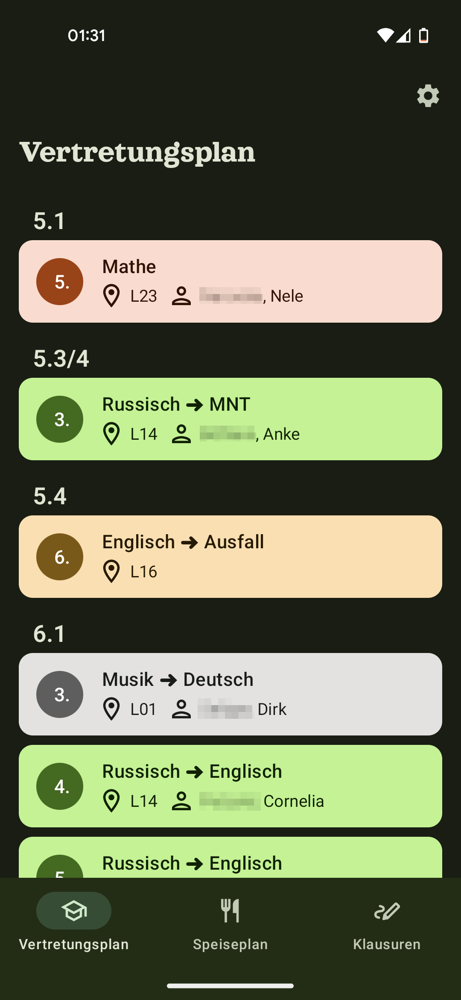
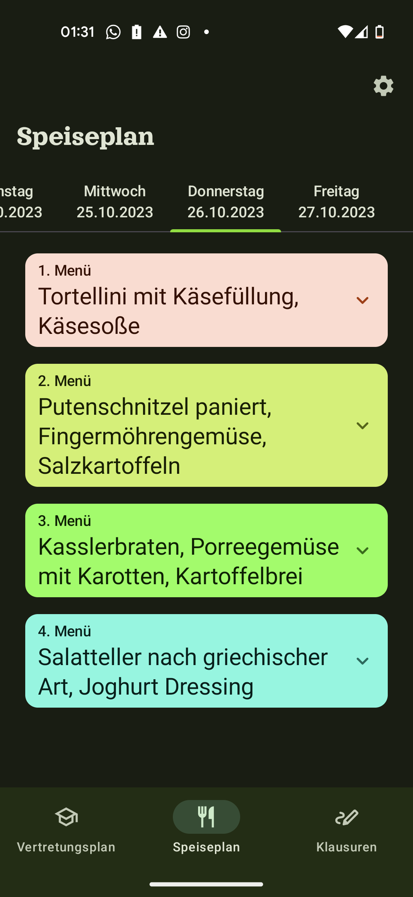
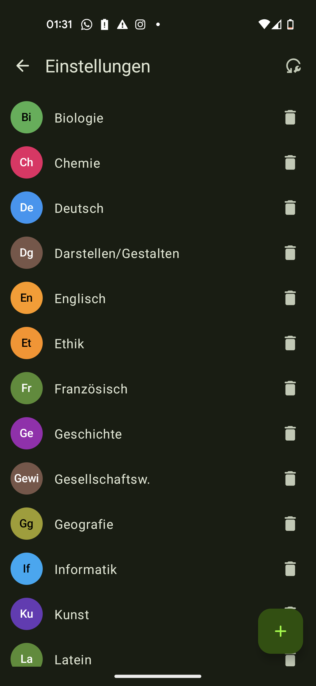
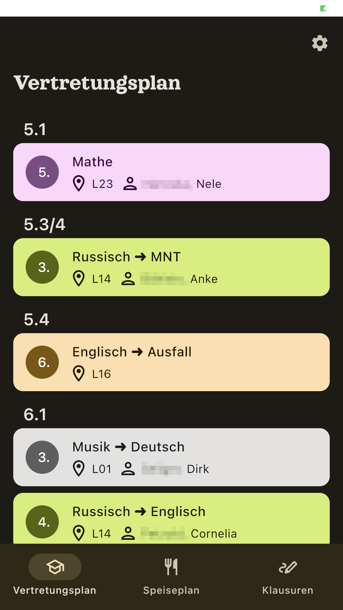

# GSApp Multiplatform Beta

## Was ist neu?
Mit Version 3 wurde die GSApp von Grund auf neu entwickelt. Hierbei wurde auf die hochmoderne "Compose Multiplatform"-Plattform gesetzt, die es ermöglicht, die App ohne viel Mehraufwand für Android, iOS, Desktop und zukünftig als Web-App bereitzustellen.

Im Zuge dessen wurde die gesamte App-Oberfläche neu im Material You-Stil gestaltet und die Informationen noch übersichtlicher darstellt.

## Also jetzt auch für iPhone?
Ja und nein - es ist durchaus möglich, die App auf iPhone zu installieren. 
Das Problem für mich als Entwickler ist aktuell, dass Apple eine Gebühr von 99€ pro Jahr erhebt, um Apps in den AppStore zu stellen - für mich als Student und für eine App, die kostenlos und werbefrei sein soll nicht erschwinglich. Möglicherweise gibt es durch neue EU-Richtlinien, die den AppStore-Zwang aufheben sollen bald neue Möglichkeiten.
Doch technisch Interessierte können das schon jetzt ausprobieren, bspw. mittels [AltStore](https://altstore.io).

## Screenshots
<figure markdown>
{: style="width:200px"}
<figcaption>Vertretungsplan (Android)</figcaption>
</figure>
<figure markdown>
{: style="width:200px"}
<figcaption>Speiseplan (Android)</figcaption>
</figure>
<figure markdown>
{: style="width:200px"}
<figcaption>Fächerverwaltung (Android)</figcaption>
</figure>
<figure markdown>
{: style="width:200px"}
<figcaption>Vertretungsplan (iOS)</figcaption>
</figure>

## Wo bekomme ich die neue Version?
Die neue Version befindet sich noch in Entwicklung, wer jedoch ausprobieren möchte, bekommt auf GitHub apk-Dateien für Android und ipa-Dateien für iOS: [GitHub Seite](https://github.com/libf-de/GSApp3-MP/releases)