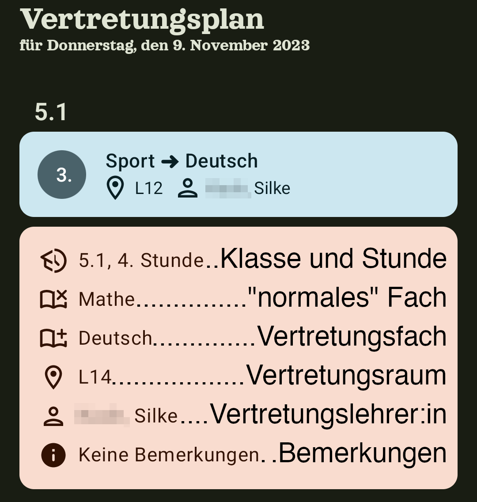
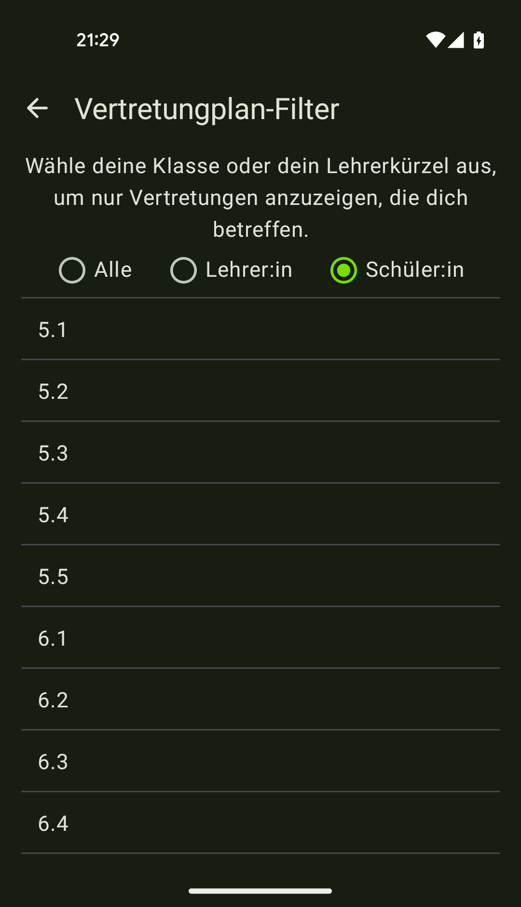
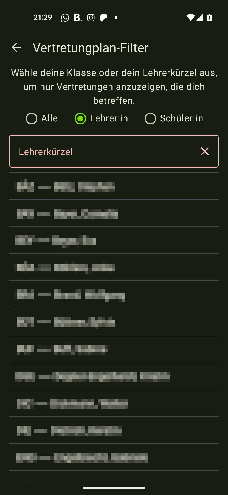
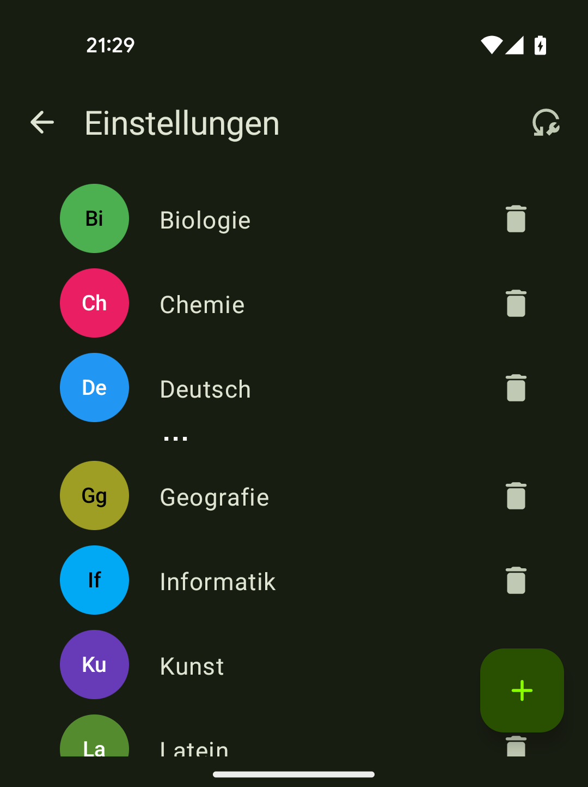
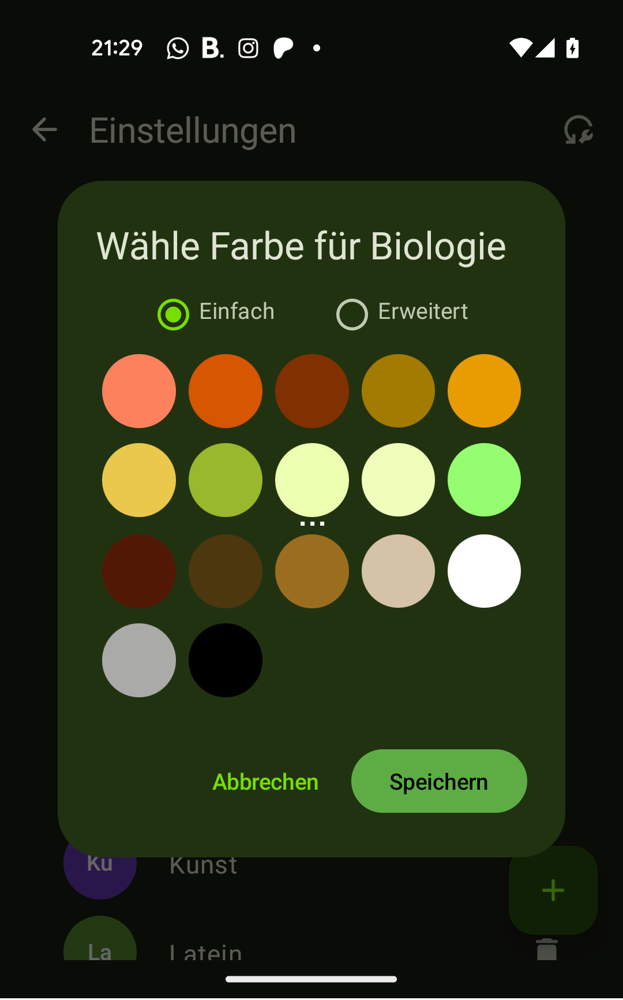

# Hilfe

## Hauptansicht
In der Hauptansicht sind die drei Hauptfunktionen (Vertretungs-, Speise- und Klausurenplan) über die Tabs am unteren Bildschirmrand erreichbar.
In der oberen Leiste befinden sich hier stets Buttons für Feedback, Aktualisieren und Einstellungen.
<figure markdown>
{: style="width:200px"}
<figcaption>Hauptansicht</figcaption>
</figure>

## Vertretungsplan
In der Vertretungsplan-Ansicht wird der aktuelle Vertretungsplan angezeigt. 

In der Kopfzeile steht das Datum des aktuellen Vertretungsplans, darunter ist, falls vorhanden, der Hinweis in einer separaten Karte. Dann folgt die Liste der Vertretungen, die nach Klassen gruppiert sind.

In den Vertretungs-Karten wird das "normale Fach" &rarr; Vertretungsfach fett angezeigt, darunter der Raum und Lehrer.
Falls eine Bemerkung vorhanden ist, wird diese rechts daneben angezeigt. 

Ist zu wenig Platz auf dem Bildschirm kann die Karte durch Antippen ausgeklappt werden.
<figure markdown>
{: style="width:200px"}
<figcaption>Vertretungsplan-Karten</figcaption>
</figure>
Die Karten sind entsprechend des "normalen" Fachs eingefärbt. Die Farben können in den [Einstellungen angepasst werden](#facherfarben-und-namen).

## Speiseplan
In der Speiseplan-Ansicht wird eine Tableiste mit den Daten der nächsten Tage angezeigt. 
Durch Tippen auf die Tableiste oder Wischen nach links/rechts kann das Datum gewechselt werden.
Darunter wird der Speiseplan des ausgewählten Datums angezeigt. Durch Antippen eines Speiseangebots
können die Zusatzstoffe ausgeklappt werden.
<figure markdown>
{: style="width:200px"}
<figcaption>Speiseplan</figcaption>
</figure>

## Klausurenplan
(in Arbeit)

## Einstellungen
In den Einstellungen können Vertretungsplan-Filter, Push-Benachrichtigungen und die Fächerfarben und -namen angepasst werden.

### Vertretungsplan-Filter
Hier kann die Klasse bzw. Vertretungslehrer:in ausgewählt werden, der im Vertretungsplan angezeigt werden soll.

Falls nach Klasse gefiltert werden soll, wähle oben "Klasse" aus und suche deine Klasse in der Liste darunter. Die Abiturklassen werden
für das aktuelle, nächste und übernächste Jahr angezeigt.
<figure markdown>
{: style="width:200px"}
<figcaption>Vertretungsplan-Filter für Schüler:innen</figcaption>
</figure>

Falls nach Lehrer:innen gefiltert werden soll, wähle oben "Lehrer:in" aus und suche deinen Namen in der Liste darunter. Durch Eingabe in das
Textfeld kann die Liste gefiltert sowie nicht vorhandene Kürzel per Hand eingegeben werden.
<figure markdown>
{: style="width:200px"}
<figcaption>Vertretungsplan-Filter für Lehrer:innen</figcaption>
</figure>

### Push-Benachrichtigungen
Hier kannst du einstellen, ob du eine Benachrichtigung erhalten möchtest, wenn ein neuer Vertretungsplan (_optional_ der dich betrifft) verfügbar ist.
<figure markdown>
{: style="width:200px"}
<figcaption>Push-Benachrichtigungen</figcaption>
</figure>

### Fächerfarben und -namen
Hier wird eine Liste der bekannten Fächer angezeigt. 
<figure markdown>
{: style="width:200px"}
<figcaption>Die Fächerliste</figcaption>
</figure>

Durch Antippen des farbigen Kreises vor einem Fach
kann dessen Farbe geändert werden - es wird ein Dialogfenster geöffnet, wo entweder aus einer Liste vorgegebener
Farben (**Einfach**) oder eine eigene Farbe (**Erweitert**) ausgewählt werden kann. 

Hierbei ist zu beachten, dass die Farbe immer an das Systemthema angepasst wird (entsprechend Google's Material You-Design).
Der Speichern-Button zeigt eine Vorschau der Farbe.
<figure markdown>
{: style="width:200px"}
<figcaption>Der Farbauswahl-Dialog</figcaption>
</figure>

Soll der Name eines Faches geändert werden, kann dies durch Antippen des langen Fachnamens geschehen.
Durch drücken der Enter-Taste oder des grünen Hakens wird der Name gespeichert, durch das rote X wird er verworfen.
<figure markdown>
{: style="width:200px"}
<figcaption>Der Fach-Editor</figcaption>
</figure>

Überschüssige Fächer können durch Antippen des Papierkorbs gelöscht werden, neue Fächer können durch Antippen des
Plus-Buttons unten rechts hinzugefügt werden. Das Fachkürzel kann nicht geändert werden, sollte dies aus irgendeinem
Grund nötig sein, kann das Fach gelöscht und neu hinzugefügt werden.
Oben rechts kann die Fächerliste zurückgesetzt werden, falls sie durch Änderungen unübersichtlich geworden ist.

## Weitere Hilfe
Sollte etwas unklar sein oder nicht funktionieren, kannst du mich gerne per Mail an
[gsapp@libf.de](mailto:gsapp@libf.de) kontaktieren.